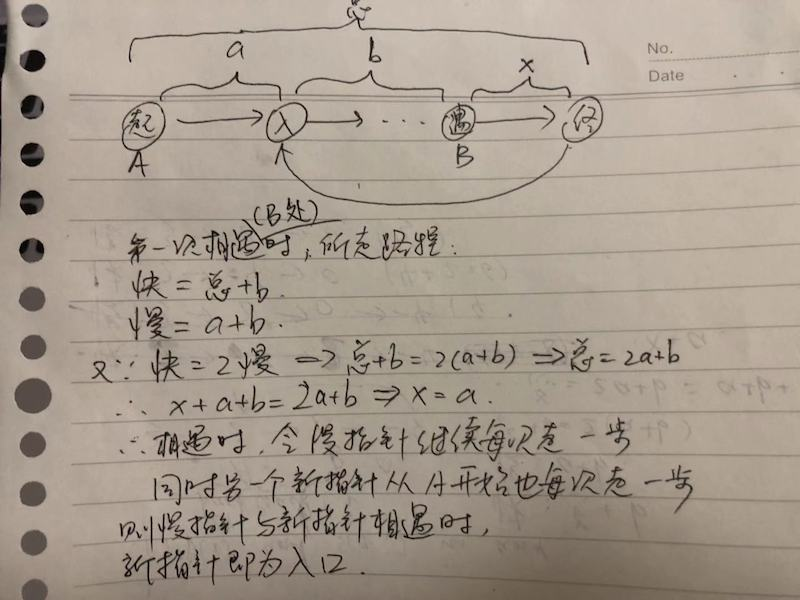

# 142. 环形链表 II

[https://leetcode-cn.com/problems/linked-list-cycle-ii/](https://leetcode-cn.com/problems/linked-list-cycle-ii/)

## 解法一：快慢指针



```python
# Definition for singly-linked list.
# class ListNode(object):
#     def __init__(self, x):
#         self.val = x
#         self.next = None

class Solution(object):
    def detectCycle(self, head):
        """
        :type head: ListNode
        :rtype: ListNode
        """         
        hasCycle = False    #是否有环
        
        if not head or not head.next:  #边界
            return None
        #初始化
        slow = head
        fast = head
        while fast.next and fast.next.next:
            slow = slow.next
            fast = fast.next.next
            if slow == fast:    #找到环即退出循环
                hasCycle = True
                break

        if hasCycle:    #若有环
            p = head  #新指针
            while p != slow:
                p = p.next
                slow = slow.next
            return p
        else:
            return None
```

