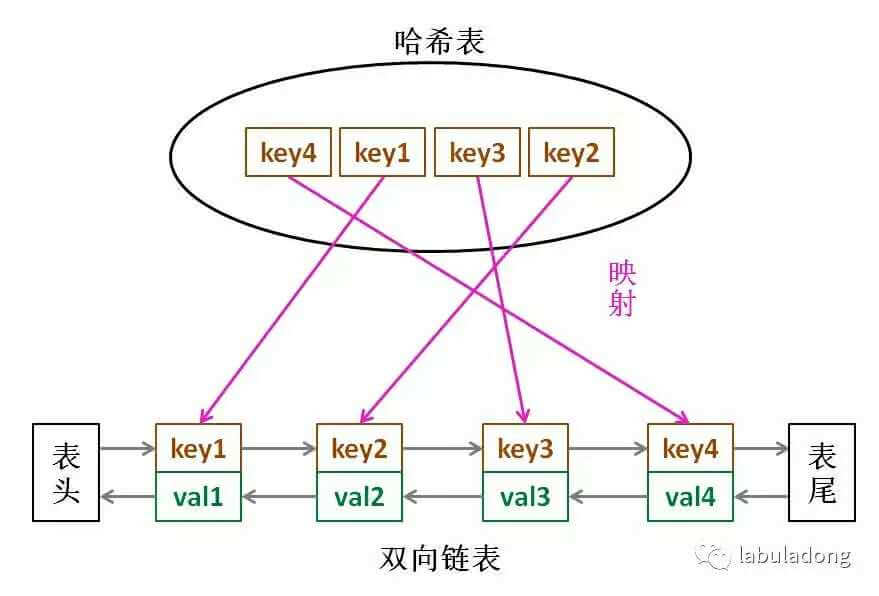

# 146.LRU缓存机制


[https://leetcode-cn.com/problems/lru-cache/](https://leetcode-cn.com/problems/lru-cache/)


### 一：双向链表+哈希表

双向链表用于实现队列，且高效出队和入队。哈希表用于快速查找



```python
#定义链表结点
class Node:
    def __init__(self, k, v):
        self.key = k
        self.val =v
        self.next = None
        self.prev = None
#定义双向链表
class DoubleList:
    def __init__(self):
        self.head = Node(0,0)
        self.tail = Node(0,0)
        self.head.next = self.tail
        self.tail.prev = self.head
        self.size = 0
    #在链表尾部添加节点 x，时间 O(1)
    def addLast(self, x):
        self.tail.prev.next = x
        x.prev = self.tail.prev
        x.next = self.tail
        self.tail.prev = x
        self.size += 1  #规模加一
    #删除链表中的 x 节点（x 一定存在）
    # 由于是双链表且给的是目标 Node 节点，时间 O(1)
    def remove(self,x):
        x.prev.next = x.next
        x.next.prev = x.prev
        self.size -= 1  #规模减一
    #删除链表中第一个节点，并返回该节点，时间 O(1)
    def removeFirst(self):
        if self.head.next == self.tail:
            return  None
        first = self.head.next
        self.remove(first)  #复用remove
        return first
      
class LRUCache:
    def __init__(self, capacity: int):
        self.cap = capacity		#容量
        self.cache = DoubleList()		#双向链表
        self.map = {}		#哈希表
    #封装一层对cache和map的操作api
    #将某个 key 提升为最近使用的
    def makeRecently(self, key):
        x = self.map[key]
        self.cache.remove(x)
        self.cache.addLast(x)
    #添加最近使用的元素
    def addRecently(self, key, val):
        x = Node(key,val)
        self.cache.addLast(x)   #插入链表头
        self.map[key] =x    #写入哈希表
    #删除某一个 key
    def deleteKey(self, key):
        x = self.map[key]
        self.cache.remove(x)
        del self.map[key]
    #删除最久未使用的元素
    def removeLeastRecently(self):
        x=self.cache.removeFirst()  #删除链表尾
        del self.map[x.key] #更新哈希表

    #题目要求实现的两个接口
    def get(self, key: int) -> int:
        if key not in self.map:
            return -1
        self.makeRecently(key)  # 设为最近使用
        return self.map[key].val

    def put(self, key: int, value: int) -> None:
        if key not in self.map:
            if self.cache.size == self.cap: #当链表满时，删除最久未使用
                self.removeLeastRecently()
            self.addRecently(key, value)
        else:
            self.deleteKey(key)
            self.addRecently(key, value)
```

