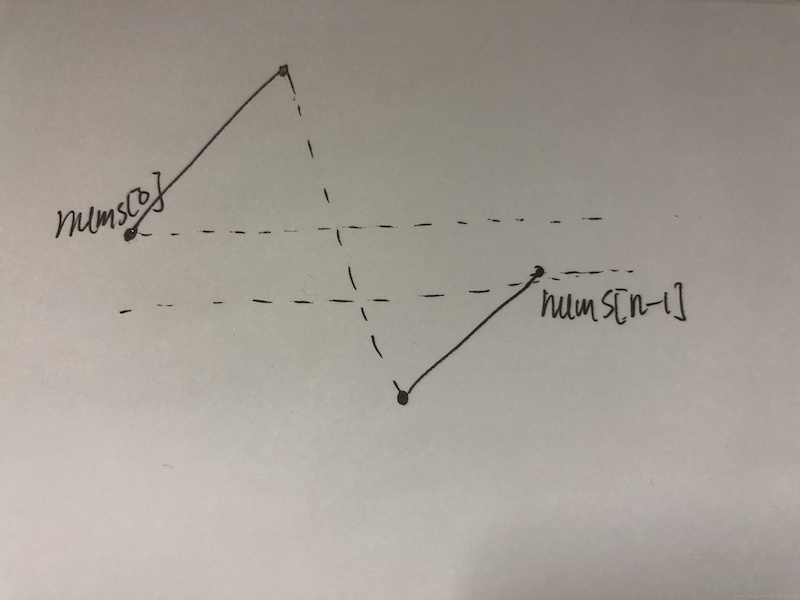

# 33. 搜索旋转排序数组

[https://leetcode-cn.com/problems/search-in-rotated-sorted-array/](https://leetcode-cn.com/problems/search-in-rotated-sorted-array/)

## 两种解法本质上都是将数组限定在同一分支内，再用二分比较

## 解法一：二分



由于是翻转数组，且无重复，因此nums\[0\]必然大于nums\[n-1\]（为什么？写出来就知道），所有的数分成两支，每支内依然升序。问题是不知道**断点在哪**。

先取mid，看target与mid是否在同一支上，若在同一支（如左分支），在看是否在有序区间\[left, mid-1\]，若在，就在左分支（\[left, mid-1\]\)搜索，否则在右分支（\[mid+1, right\]\)，以此类推。

算法：

1\) 每次检查`target == nums[mid]` ，若相等则找到

 2\) 否则检查mid在左分支 \(即 `nums[left] <= nums[mid]`\)还是右分支。若在左分支，执行 步骤3\), 若在右分支执行 步骤 4\)

 3\) 检查target是否在`[left, mid-1]` 范围内\(即`nums[left] <= target < nums[mid]`\), 若在，在左部分搜索 ，即 `right = mid-1`; 否则在右部分搜索，即`left = mid+1`; 

4\) 检查target`[mid+1, right]` 范围内\(即 `nums[mid] < target <= nums[right]`\), 若在，在右部分搜索 ，即`left = mid+1`; 否则在左部分搜索，即 `right = mid-1`;

```python
class Solution:
    def search(self, nums: List[int], target: int) -> int:
        n = len(nums)
        left, right = 0, n-1
        while left <= right:
            mid = (left + right) // 2
            if nums[mid] == target:
                return mid
            elif nums[mid] >= nums[left]:    #mid在左分支
                if nums[left] == target:    #若找到直接返回
                    return left
                elif nums[left] < target and target < nums[mid]:
                    right = mid - 1
                else:
                    left = mid + 1
            else:                            #mid在右分支
                if nums[right] == target:    #若找到直接返回
                    return right
                elif nums[mid] < target and target < nums[right]:
                    left = mid + 1
                else:
                    right = mid - 1
        return -1  #找不到
```

## 解法二：二分（用辅助tmp）

可以先取mid，看target与mid是否在同一支上，若在同一支，可以直接在该支上做二分查找。

若不在同一支，例如tar在左，mid在右，则下界往左收缩，然而不能直接比较tar和mid**（因为不在同一支，直接比较无意义）**，这里处理断点用一个tmp辅助，用来与tar比较，若tar在左mid在右，显然无法直接二分，此时令tmp=正无穷，tar&lt;tmp，lo=mid+1。

反之若tar在右，mid在左，则上界往右收缩则令tmp=负无穷，易知hi=mid-1

```python
class Solution:
    def search(self, nums: List[int], target: int) -> int:
        n = len(nums)
        lo, hi = 0, n-1
        tmp = 0
        while lo <= hi:  #二分查找
            mid = (lo + hi) // 2 
            if target > nums[0]:  #target在左分支
                if nums[mid] >= nums[0]:  #mid也在左分支
                    tmp = nums[mid]
                else:  #mid在右分支
                    tmp = float('inf')
            elif target == nums[0]:  #恰好等于左端点
                return 0
            elif target == nums[n-1]:  #恰好等于右端点
                return n-1
            elif target < nums[n-1]:  #target在右分支
                if nums[mid] < nums[0]:  #mid也在右分支
                    tmp = nums[mid]
                else:  #mid在左分支
                    tmp = -float('inf')
            #二分，用tmp而不是mid与tar比较
            if tmp < target:
                lo = mid + 1
            elif tmp > target:
                hi = mid - 1
            else:
                return mid
        return -1
```

