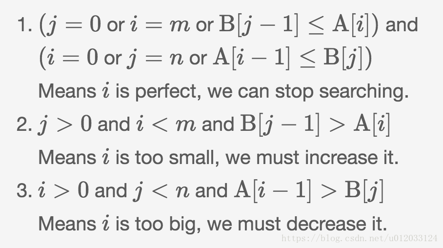

# 4. 寻找两个有序数组的中位数

[https://leetcode-cn.com/problems/median-of-two-sorted-arrays/](https://leetcode-cn.com/problems/median-of-two-sorted-arrays/)

## 解法一：暴力

两数组合并找中位数，时间复杂度不符合要求。

## 解法二：二分

将A，B分成两部分，各自以i，j为界：

```text
      left_part          |        right_part
A[0], A[1], ..., A[i-1]  |  A[i], A[i+1], ..., A[m-1]
B[0], B[1], ..., B[j-1]  |  B[j], B[j+1], ..., B[n-1]
```

若能满足**前提**：

```text
len(left_part) = len(right_part)
max(left_part) ≤ min(right_part)
```

则中位数容易求得：

```text
median = (max(left_part) + min(right_part)) / 2
```

**思路**：每次在A中取中点i，根据**前提**约束求`j = (m+n+1)//2 - i`，然后比较i，j所指元素的大小关系，调整区间。

主要根据这个结论，分三种情况：



解释一下第一种情况，为何`j=0，i=m和B[j-1]<=A[i]`是等效的： 

j=0，说明B的left部分为空，即B的right部分均大于A的left，（加上A的right本来就大于A的left）因此必然`max(left_part) ≤ min(right_part)`；

 i=m，说明A的right为空，即A的left均小于B的right，因此必然`max(left_part) ≤ min(right_part)`；

B\[j-1\]&lt;=A\[i\]，这个不用解释了，即B的left中最大&lt;=A的right中最小，必然`max(left_part) ≤ min(right_part)`；

同理，`i=0，j=n和A[i-1]<=B[j]`也是这样分析。 

这两个条件必须**同时**满足。

此外为何`j = (m+n+1)//2 - i`?   
因为分析中要将A，B划分成**相等**的两段 此时`i+j=m-i+n-j`， 即`j=(m+n)//2-i`

然而左右两段不一定相等（当m+n为奇数时）：`i+j=m-i+n-j+1`,即`j=(m+n+1)//2-i`   
由于j是int类型，因此即使m+n是偶数，+1再除以2依然是原来的结果，就可以将m+n的奇数和偶数两种情况统一起来：   
`j = (m+n+1)//2 - i`

```python
class Solution:
    def findMedianSortedArrays(self, A: List[int], B: List[int]) -> float:
        m, n = len(A), len(B)
        #有一个数组为空，直接求另一个的中位数
        if m == 0:
            return B[n//2]if n%2 == 1 else (B[n//2] + B[n//2-1]) / 2
        if n == 0:
            return A[m//2]if m%2 == 1 else (A[m//2] + A[m//2-1]) / 2
        if m > n:   #保证m<=n，用交换
            A, B, m, n = B, A, n, m
            
        iMin, iMax = 0, m
        while iMin <= iMax:     #在[iMin, iMax]之间搜索
            i = (iMin + iMax) // 2    #i取中点
            j = (m+n+1)//2 - i    #前提约束求j
            
            if j > 0 and i < m and B[j-1] > A[i]:   #情况2
                iMax += 1
            elif i > 0 and j < n and A[i-1] > B[j]:     #情况3
                iMin -= 1
            else:   #情况1
                if i == 0: leftMax = B[j-1]
                elif j == 0: leftMax = A[i-1]
                else: leftMax = max(A[i-1], B[j-1])
                #若总长度为奇，则leftMax就是中位数
                if (m+n)%2 == 1:
                    return leftMax
                
                if i == m: rightMin = B[j]
                elif j == n: rightMin = A[i]
                else: rightMin = min(A[i], B[j])
                #若总长度为偶，用公式计算中位数
                return (leftMax + rightMin) / 2
```

