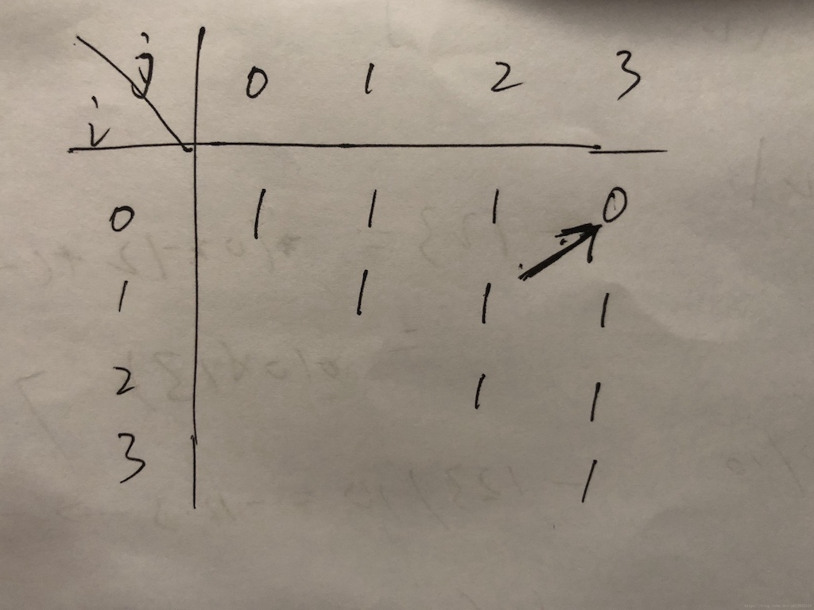

# 5. 最长回文子串

[https://leetcode-cn.com/problems/longest-palindromic-substring/](https://leetcode-cn.com/problems/longest-palindromic-substring/)

## 解法一：暴力

两个for循环，外层i遍历每个字符，然后内层j从i分别向两侧出发，找两头是否相等，不相等就退出循环。每次找到一个回文串，求长度，并记录首尾位置。

```python
class Solution {
public:
    string longestPalindrome(string s) {
        int maxLen = 0;
        int n = s.length();
        int start = 0, end = 0;
        for (int i = 0; i < n; i++) {
            for (int j = 0; i-j >= 0 && i+j < n && s[i+j] == s[i-j]; j++) {  //回文长度为奇
                if (2*j+1 > maxLen) {  // len = (i+j)-(i-j)+1 = 2*j+1
                    start = i-j;
                    end = i+j;
                    maxLen = 2*j+1;
                }
            }
            for (int j = 0; i-1-j >= 0 && i+j < n && s[i-1-j] == s[i+j]; j++) {  //回文长度为偶
                if(2*j+2 > maxLen) {  // len = (i+j)-(i-1-j)+1 = 2*j+2
                    start = i-1-j;
                    end = i+j;
                    maxLen = 2*j+2;
                }
            }
        }
        return s.substr(start, end-start+1);
    }
};
```

```python
#python3:注意将c++中带复杂条件的for语句转换为py时，
#只能转成while语句来判断条件，在循环外设j初始值，在语句最后j自增
class Solution:
    def longestPalindrome(self, s: str) -> str:
        maxLen = 0
        n = len(s)
        start = 0
        end = 0
        for i in range(n):
            j = 0
            while i-j >= 0 and i+j < n and s[i+j] == s[i-j]:
                if 2*j+1 > maxLen:
                    start = i-j
                    end = i+j
                    maxLen = 2*j+1
                j += 1
            j = 0
            while i-1-j >= 0 and i+j < n and s[i-1-j] == s[i+j]:
                if 2*j+2 > maxLen:
                    start = i-1-j
                    end = i+j
                    maxLen = 2*j+2
                j += 1
        return s[start:end+1]
```

## 解法二：DP

`dp(i, j)` represents whether `s(i ... j)` can form a palindromic substring, `dp(i, j)` is true when s\(i\) equals to s\(j\) and `s(i+1 ... j-1)` is a palindromic substring. When we found a palindrome, check if it’s the longest one. Time complexity O\(n^2\). 需要注意的是构造初始解时，i是从n-1开始，为何？

看下图可知，对于串“aaaa”：



```cpp
// cpp
class Solution {
public:
    string longestPalindrome(string s) {
        int n = s.length();
        string res = "";
        vector<vector<int>> dp(n, vector<int>(n, 0));  //记录表
        for (int i = n - 1; i >= 0; i--) {  //从n-1开始
            for (int j = i; j < n; j++) {
                dp[i][j] = s[i] == s[j] && (j - i < 3 || dp[i + 1][j - 1]);

                if (dp[i][j] && (res == "" || j - i + 1 > res.length())) {
                    res = s.substr(i, j - i + 1);
                }
            }
        }   
        return res;
    }
};
```

```python
#python3
class Solution:
    def longestPalindrome(self, s: str) -> str:
        maxLen = 0
        n = len(s)
        res = ""
        dp = [[0 for i in range(n)] for i in range(n)]  #二维数组创建
        for i in range(n-1, -1, -1):
            for j in range(i, n):
                dp[i][j] = (s[i] == s[j] and (j - i < 3 or dp[i+1][j-1]))
                if dp[i][j] and (res == "" or j - i + 1 > len(res)):
                    res = s[i:j+1]
        return res
```

实际上j由大到小也可以（待解释

```python
class Solution:
    def longestPalindrome(self, s: str) -> str:
        maxLen = 0
        n = len(s)
        res = ""
        dp = [[0 for i in range(n)] for i in range(n)]  #二维数组创建
        for i in range(n-1, -1, -1):
            for j in range(n-1, i-1, -1):  #j由大到小
                dp[i][j] = (s[i] == s[j] and (j - i < 3 or dp[i+1][j-1]))
                if dp[i][j] and (res == "" or j - i + 1 > len(res)):
                    res = s[i:j+1]
        return res
```

然而运行时dp比暴力慢许多，不知为何

