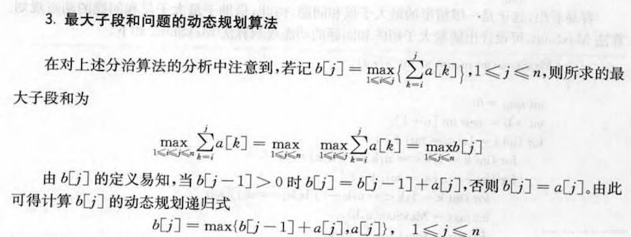

# 53. 最大子序和

[https://leetcode-cn.com/problems/maximum-subarray/](https://leetcode-cn.com/problems/maximum-subarray/)

## 解法一：暴力

遍历所有长度的连续子段，but超时

```python
class Solution:
    def maxSubArray(self, nums: List[int]) -> int:
        res = -sys.maxsize
        for i in range(len(nums)):
            for j in range(i, -1, -1):
                res = max(res, sum(nums[j:i+1]))
        return res
```

## 解法二：dp



摘自《计算机算法设计与分析》王晓东 第3版

```python
class Solution:
    def maxSubArray(self, nums: List[int]) -> int:
        sum = nums[0]  #初始累加和
        b = nums[0]  #dp初始状态，0号
        for i in range(1, len(nums)):  #从1号开始
            if b > 0:
                b += nums[i]
            else:
                b = nums[i]
            sum = max(b, sum)
        return sum
```

2020.3.29

```python
class Solution:
    def maxSubArray(self, nums: List[int]) -> int:
        n = len(nums)
        dp = [0] * n
        res = nums[0]
        if n == 1:
            return res
        dp[0] = nums[0]    #初始
        #用dp[i]记录0~i处最大子序和（包括i）
        for i in range(1, n):
            if dp[i-1] < 0:    #若前面的和小于0，则舍弃
                dp[i] = nums[i]
            else:
                dp[i] = dp[i-1] + nums[i]
            res = max(res, dp[i])     #更新最大和
        return res
```

