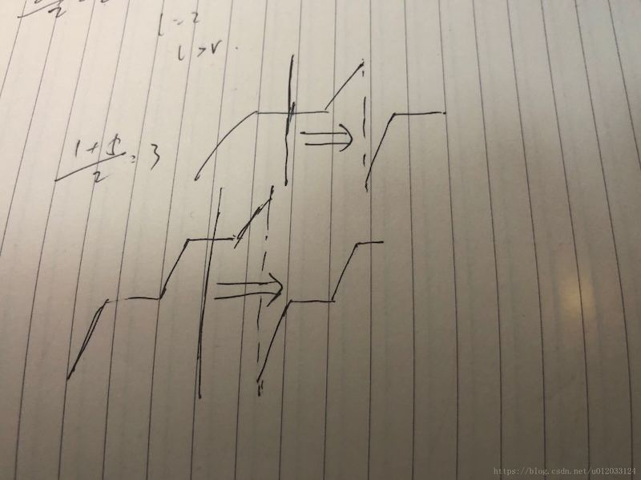

# 81. 搜索旋转排序数组 II

[https://leetcode-cn.com/problems/search-in-rotated-sorted-array-ii/description/](https://leetcode-cn.com/problems/search-in-rotated-sorted-array-ii/description/)

## 解法一：二分

注意与 **33. 搜索旋转排序数组** 的不同在于有重复。



与33题解法的区别在于排除重复元素的干扰

例如对于case: \[0,1,0,0,0\]，第一次mid=2，2号元素为0&gt;=nums\[left\]，算法判断其在左分支，然而画图可知其实在右分支。trick就是当两边端点left，right都与mid相等时，将left，right分别往回缩一位。

```python
class Solution:
    def search(self, nums: List[int], target: int) -> bool:
        n = len(nums)
        left, right = 0, n-1
        while left <= right:
            mid = (left + right) // 2
            if target == nums[mid]:
                return True
            #trick，排除重复干扰
            if nums[left] == nums[mid] and nums[right] == nums[mid]:
                left += 1
                right -= 1
            elif nums[left] <= nums[mid]:
                if nums[left] <= target and target < nums[mid]:
                    right = mid - 1
                else:
                    left = mid + 1
            else:
                if nums[mid] < target and target <=  nums[right]:
                    left = mid + 1
                else:
                    right = mid - 1
        return False

```

