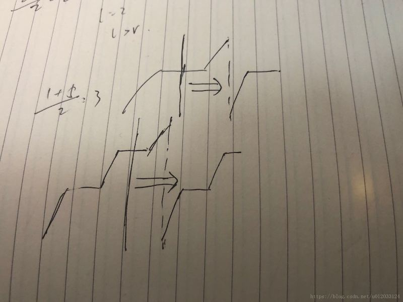

# 81. 搜索旋转排序数组 II

[https://leetcode-cn.com/problems/search-in-rotated-sorted-array-ii/description/](https://leetcode-cn.com/problems/search-in-rotated-sorted-array-ii/description/)

## 解法一：二分

注意与 **33. 搜索旋转排序数组** 的不同在于有重复。



与33题解法的区别在于排除重复元素的干扰
注意判断左右分支的方式有两种，左分支可以与n-1号元素相比，也可以与right比，但都必须用大于，因为有重复
```python
class Solution:
    def search(self, nums, target: int) -> bool:
        n = len(nums)
        left, right = 0, n-1
        while left <= right:
            if nums[left] == target or nums[right] == target:
                return True
            mid = left + (right - left) // 2
            if nums[mid] == target:
                return True
            # mid在左分支（当[left,right]中间有断点）
            # 或者[left,right]已经无断点，但[left,mid]是肯定无断点
            if nums[mid] > nums[n-1]:   # if nums[mid] > nums[right]:
                if nums[left] < target and target < nums[mid]:
                    right = mid - 1
                else:
                    left = mid + 1
            # mid在右分支，分析同上
            elif nums[mid] < nums[0]:   # elif nums[mid] < nums[left]:
                if nums[mid] < target and target < nums[right]:
                    left = mid + 1
                else:
                    right = mid - 1
            else:   #无法确定在哪个分支
                left += 1
                right -= 1
        return False
```

