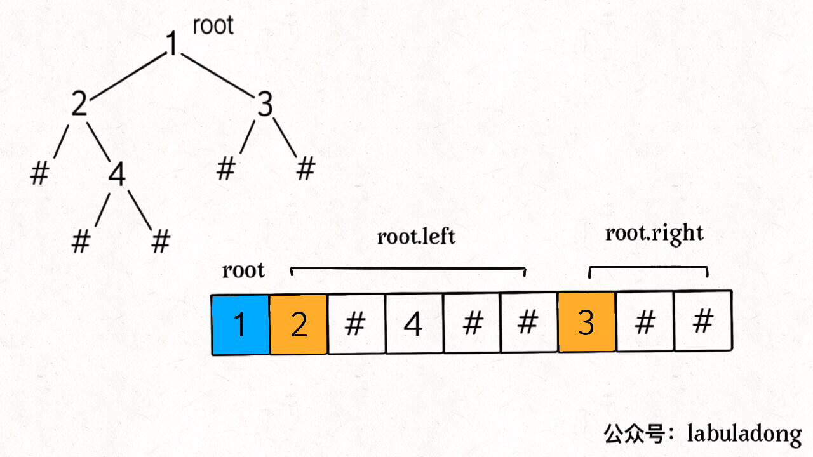

# 297. 二叉树的序列化与反序列化

 [https://leetcode-cn.com/problems/serialize-and-deserialize-binary-tree/](https://leetcode-cn.com/problems/serialize-and-deserialize-binary-tree/)


思路很直接，先写一个序列化函数将树按某个顺序（前、中、后、层序）遍历输出，再写一个反序列化函数用相同的遍历方法将其还原

## 一、前序

注意：一般语境下，单单前序遍历结果是不能还原二叉树结构的，因为缺少**空指针**的信息，至少要得到前、中、后序遍历中的两种才能还原二叉树。但是这里的 `node` 列表包含空指针的信息，所以只使用 `node` 列表就可以还原二叉树。



```python
class Codec:
    str = ''
    def serialize(self, root):
        """Encodes a tree to a single string.
        :type root: TreeNode
        :rtype: str
        """
        def traval(root):
            if root == None:
                self.str += 'null,'
                return
            self.str += str(root.val) + ','
            self.serialize(root.left)
            self.serialize(root.right)
        traval(root)
        return self.str[:-1]
    def deserialize(self, data):
        """Decodes your encoded data to tree.
        :type data: str
        :rtype: TreeNode
        """
        nodes = data.split(',')
        def des(nodes):
            val  = nodes.pop(0)
            if val == 'null':
                return
            root = TreeNode(int(val))
            root.left = des(nodes)
            root.right = des(nodes)
            return root
        return des(nodes)

```

