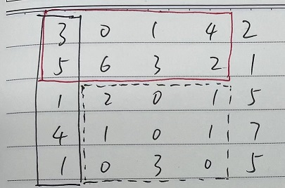
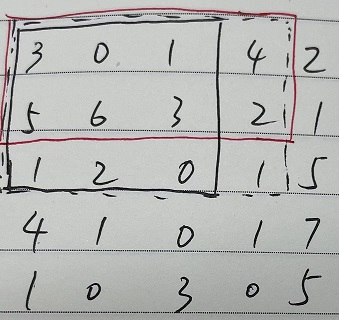

# 304. 二维区域和检索 - 矩阵不可变
[https://leetcode-cn.com/problems/range-sum-query-2d-immutable/](https://leetcode-cn.com/problems/range-sum-query-2d-immutable/)

## 一、二维前缀和


虚线矩形的和，可以由四个以原点为顶点的矩形和凑出：`(0,0) 到(4,4)的最大矩形 - 黑色 - 红色 + 黑红重叠`，这样sumRegion的实现可以预先计算所有原点为顶点的矩形，然后秒出


计算以原点为顶点的矩形，用前缀和`preSum[i][j]`表示(0,0)到(i,j)的矩形和，如图虚线矩形等于`黑色 + 红色 - 重叠 + 右下角元素`，即`preSum[i][j] = preSum[i][j-1] + preSum[i-1][j] - preSum[i-1][j-1] + matrix[i-1][j-1]`

```python
class NumMatrix:

    def __init__(self, matrix: List[List[int]]):
        m,n = len(matrix), len(matrix[0])
        self.preSum = [[0] * (n+1) for _ in range(m+1)]
        for i in range(1, m+1):
            for j in range(1, n+1):
                self.preSum[i][j] = self.preSum[i-1][j] + self.preSum[i][j-1] - self.preSum[i-1][j-1] + matrix[i-1][j-1]

    def sumRegion(self, row1: int, col1: int, row2: int, col2: int) -> int:
        return self.preSum[row2+1][col2+1] - self.preSum[row2+1][col1] - self.preSum[row1][col2+1] + self.preSum[row1][col1]


```

