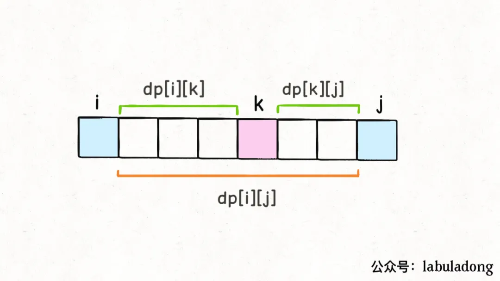
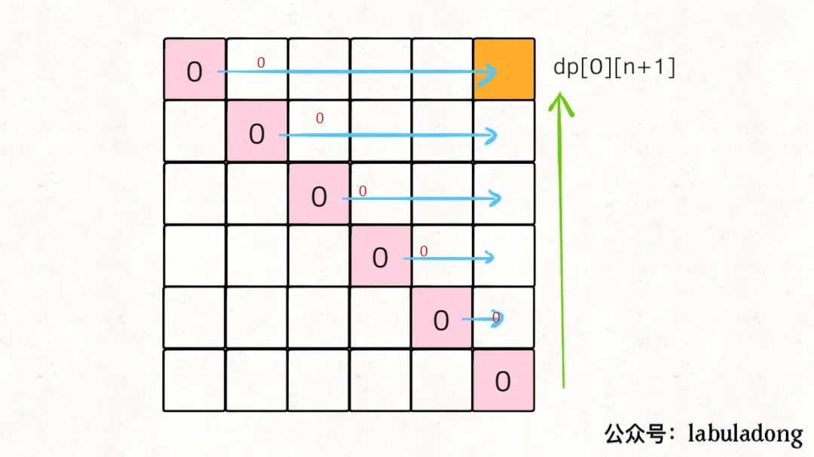

# 312.戳气球

[https://leetcode-cn.com/problems/burst-balloons/](https://leetcode-cn.com/problems/burst-balloons/)

## 一：回溯
超时
```python
class Solution:
    def maxCoins(self, nums) -> int:
        self.res = 0
        def bt(nums, score):
            n = len(nums)
            if n ==0:
                self.res = max(self.res ,score)
                return
            for i in range(n):
                tmp = nums
                s=0
                if n==1:
                    s = nums[0]
                elif i == 0:
                    s = nums[i] *nums[i+1]
                elif i == n-1:
                    s = nums[i-1]*nums[i]
                else:
                    s = nums[i-1]*nums[i]*nums[i+1]
                nums = nums[0:i] + nums[i + 1:]
                bt(nums, score+s)
                nums = tmp
        bt(nums, 0)
        return self.res
```

## 二：dp

逆向思维，考虑气球i和气球j之间最后一个被戳破的气球k是哪个，就是一种选择
用`dp[i][j]`表示戳破气球i和j之间的最高分，开区间不包含i和j，易知j <= i+1时dp=0



由于是开区间，`dp[i][k]`和`dp[k][j]`都不会影响气球k（i<k<j)，最后戳破气球k前这两部分都已戳破，k相邻的是i和j，此时戳破k，得分即状态转移方程：

```
dp[i][j] = max(dp[i][j], dp[i][k] + dp[k][j] + s[i] * s[k] * s[j])
                          戳(i,k)     戳(k,j) 	     戳k
```

在原数组首尾添加辅助元素1，数组长度变为n+1，最后所求为`dp[0][n+1]`



由上图可知对角线上方的斜线也是0，因此i遍历可以从倒数第三行开始，即n-1

```python
class Solution:
    def maxCoins(self, nums) -> int:
        n = len(nums)
        s = nums.copy()  # 辅助数组
        s = [1] + s + [1]

        dp = [[0] * (n + 2) for _ in range(n + 2)]
        for i in range(n - 1, -1, -1):
            for j in range(i + 1, n + 2):
                for k in range(i + 1, j):
                    dp[i][j] = max(dp[i][j], dp[i][k] + dp[k][j] + s[i] * s[k] * s[j])

        return dp[0][n + 1]
```