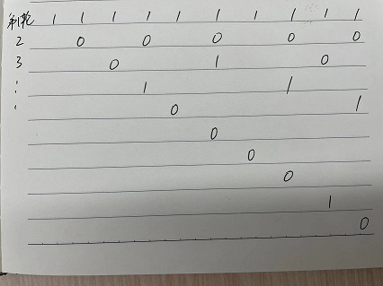

# 319.灯泡开关

#### [https://leetcode-cn.com/problems/bulb-switcher/](https://leetcode-cn.com/problems/bulb-switcher/)



画出每轮的变化，1表示开灯0表示关灯，由图可知，就是找1~n有多少个除数，除数为偶数个则最后为0（关灯），为奇数则最后为1（开灯）

统计除数，考虑对称性，如`16=2*8=8*2`，因此当两个因数a、b不相等时一定会存在对称的b、a，相等时只有一对a、b。且遍历找n的除数只需要遍历到到根号n

```python
class Solution:
    def bulbSwitch(self, n: int) -> int:
        res = 0
        for i in range(1, n+1):
            cnt = 0
            j=1
            while j * j <= i:
                if i % j == 0:
                    cnt += 1
                    if j * j != i:
                        cnt += 1
                j += 1
            if cnt % 2:
                res += 1
        return res
```

## 改进

上面方法TLE，其实观察知没必要算n有多少个除数，只需要看n是否为完全平方数（即找到n=j^2）就能判断除数个数是否为奇数

```python
class Solution:
    def bulbSwitch(self, n: int) -> int:
        res = 0
        for i in range(1, n+1):
            j = int(sqrt(i))
            if j ** 2 == i:		#j是i的平方根
                res += 1
        return res
```

依然TLE，继续观察发现，1，2，……，n的完全平方数个数就是floor(根号n)，由于 根号n涉及到浮点数运算，为了保证不出现精度问题，可以计算根号(n+0.5)

```python
class Solution:
    def bulbSwitch(self, n: int) -> int:
        return int(sqrt(n + 0.5))
```


