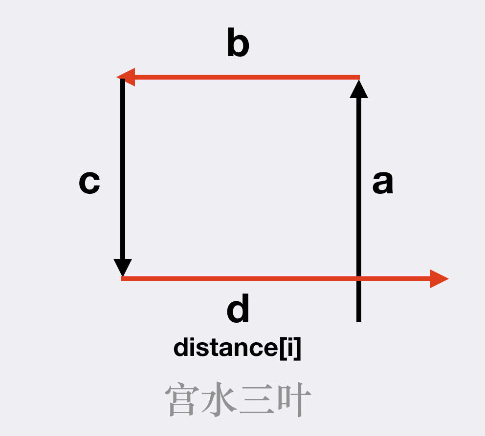
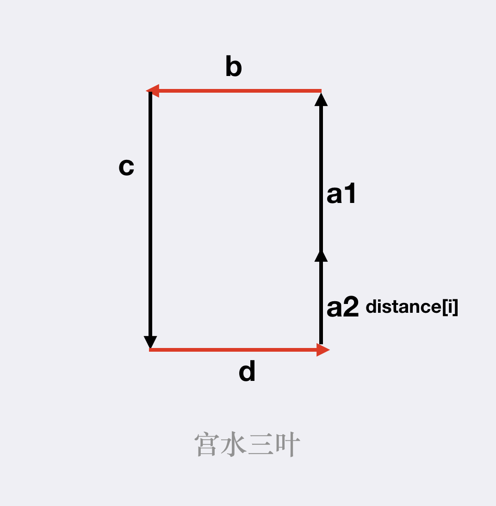
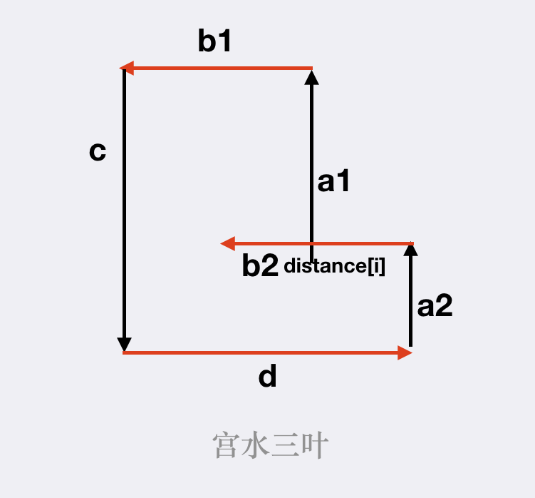

# 335.路径交叉

[https://leetcode-cn.com/problems/self-crossing/](https://leetcode-cn.com/problems/self-crossing/)

情况1：d[i] 与 d[i - 3]发生相交：此时满足 d[i] >= d[i−2]，同时 d[i - 1] <= d[i - 3]



情况2：d[i]与 d[i - 4]发生相交：此时满足d[i−1] == d[i−3]，同时 d[i] + d[i - 4] >= d[i - 2]



情况3：d[i]与 d[i - 5]发生相交：此时满足d[i−1]<=d[i−3]，同时 d[i - 2] > d[i - 4]，同时 d[i] + d[i - 4] >= d[i - 2]，同时 d[i - 1] + d[i - 5] >= d[i - 3]



i与i-6的情况？这俩是平行且反向的，若i与i-5相交则必然与i-6相交

i与i-7的情况，画图可知会被与i-3的情况覆盖，不需要重复考虑

i与i-8同样被i与i-4覆盖

因此最多只需要考虑i到i-5即可

```python
class Solution:
    def isSelfCrossing(self, d):
        n = len(d)
        if n < 4:
            return False
        for i in range(3, n):
            if d[i] >= d[i - 2] and d[i - 1] <= d[i - 3]:
                return True
            if i >= 4 and d[i-1] == d[i - 3] and d[i] + d[i - 4] >= d[i - 2]:
                return True
            if i >= 5 and d[i - 1] <= d[i - 3] and d[i - 2] > d[i - 4] and d[i] + d[i - 4] >= d[i - 2] and d[i - 1] + d[i - 5] >= d[i - 3]:
                return True
        return False
```

