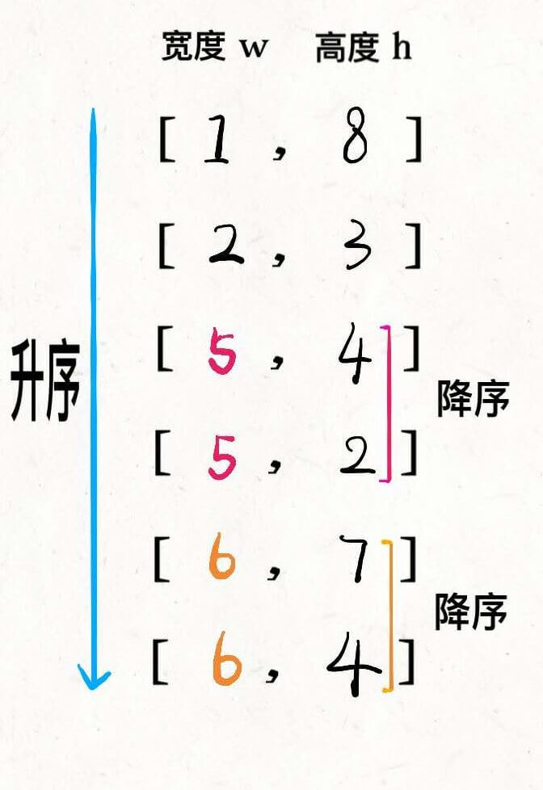

# 354. 俄罗斯套娃信封问题
[https://leetcode-cn.com/problems/russian-doll-envelopes/](https://leetcode-cn.com/problems/russian-doll-envelopes/)
## 解法一



先对宽度 w 进行升序排序，如果遇到 w 相同的情况，则按照高度 h 降序排序。之后把所有的 h 作为一个数组，在这个数组上计算 LIS 的长度就是答案。

```python
class Solution:
    def maxEnvelopes(self, envelopes) -> int:
        def lengthOfLIS(nums):
            n = len(nums)
            maxLen = 0
            dp = [1] * n
            for i in range(n):
                for j in range(i):
                    if nums[i] > nums[j]:
                        dp[i] = max(dp[i], dp[j] + 1)
                maxLen = max(maxLen, dp[i])
            return maxLen

        # 先排序整理，以w为升序，w相等时h降序
        envelopes.sort(key=lambda x: (x[0], -x[1]))
        nums = []
        for e in envelopes:
            nums.append(e[1])
        return lengthOfLIS(nums)
```