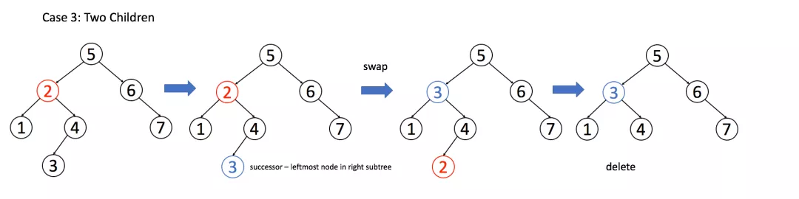

# 450.删除二叉搜索树中的节点

[https://leetcode-cn.com/problems/delete-node-in-a-bst/](https://leetcode-cn.com/problems/delete-node-in-a-bst/)

### 一、递归遍历

删除一个节点A，有三种情况

**情况 1**：`A`恰好是末端节点，两个子节点都为空，直接干掉即可

**情况 2**：`A`只有一个非空子节点，那么它要让这个孩子接替自己的位置。

**情况 3**：`A`有两个子节点，较为麻烦，为了不破坏 BST 的性质，`A`必须找到左子树中最大的那个节点，或者右子树中最小的那个节点来接替自己。此处选择找右子树最小



```python
class Solution:
    def deleteNode(self, root, key: int) :
        #辅助函数，找以root为根的最小节点（即最左）
        def getMin(root):
            while root.left:
                root = root.left
            return root
        
        if root == None:
            return
        if key < root.val:
            root.left = self.deleteNode(root.left, key)
        elif key > root.val:
            root.right = self.deleteNode(root.right, key)
        else:
            if root.left == None:
                return root.right
            elif root.right == None:
                return root.left
            #左右子都不为空
            minNode = getMin(root.right)    #找右子树中最小节点
            root.val = minNode.val  #将最小节点的值移到root处
            root.right = self.deleteNode(root.right, minNode.val)   #删除最小节点

        return root
```

