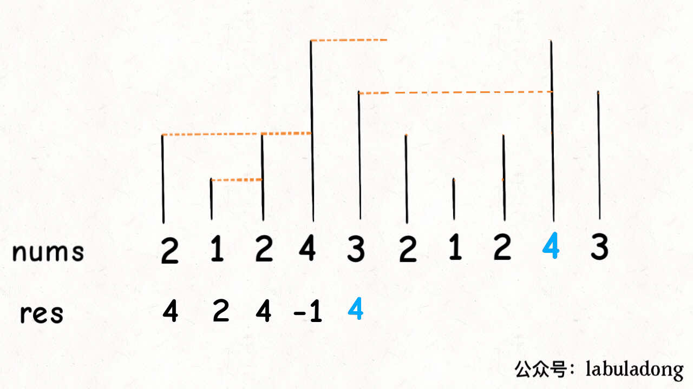

# 503.下一个更大元素II

[https://leetcode-cn.com/problems/next-greater-element-ii/](https://leetcode-cn.com/problems/next-greater-element-ii/)

技巧一：**对于这种需求，常用套路就是将数组长度翻倍**：



然后在翻倍数组上，按496. 下一个更大元素 I的解法三，套用单调栈模板即可

技巧二：实际上不用真的把数组翻倍，只需取模运算，”假装“该数组长度翻倍

```python
class Solution:
    def nextGreaterElements(self, nums) :
        n = len(nums)
        res = [-1]*n
        stack = []
        # ”假装“该数组长度翻倍，然后用取模映射到原数组
        for i in range(n*2-1, -1, -1):
            while stack and stack[-1] <= nums[i%n]:
                stack.pop()
            res[i%n] = stack[-1] if stack else -1
            stack.append(nums[i%n])
        return res
```