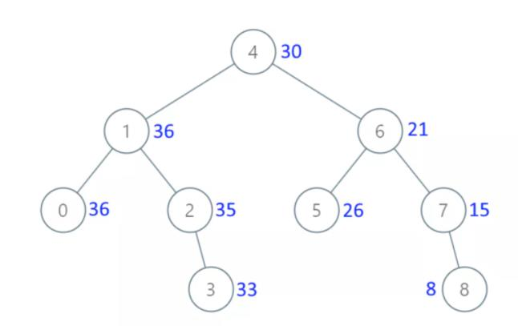

# 538.把二叉搜索树转换位累加树

[https://leetcode-cn.com/problems/convert-bst-to-greater-tree/](https://leetcode-cn.com/problems/convert-bst-to-greater-tree/)

### 一：反向中序遍历



根据二叉搜索树性质，反向中序遍历，累加路径上的每个节点，就得到8，15，21，26，30……

```python
class Solution:
    def convertBST(self, root: Optional[TreeNode]) -> Optional[TreeNode]:
        self.sum  = 0	#全局变量用于累加
        def reverseInOrder(root):
            if root == None:
                return 0
            #中序遍历（反向）框架
            reverseInOrder(root.right)
            self.sum += root.val	#累加每个节点
            root.val = self.sum		#修改当前节点值
            reverseInOrder(root.left)
        reverseInOrder(root)
        return root
```


