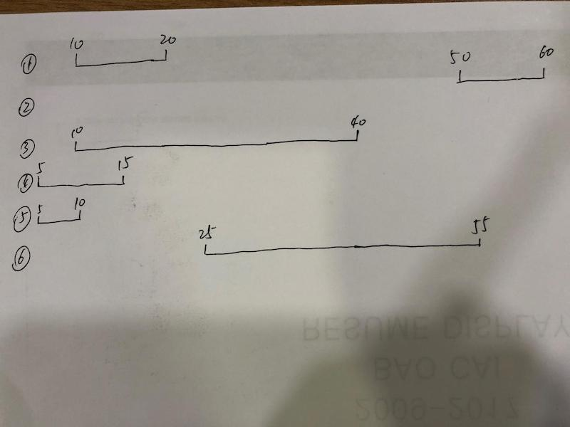

# 732. 我的日程安排表 III

[https://leetcode-cn.com/problems/my-calendar-iii/](https://leetcode-cn.com/problems/my-calendar-iii/)

## 解法一：map​

本题是要求出当前并发的日期区间的最大值,即下图中最多有多少个重叠段. 

例如:第五次操作调用`MyCalendarThree.book(5, 10);` \[5,10\)与\[5,15\)是两个重叠段,然而为何返回3呢?往上看,\[5,15\),\[10,40\)与\[10,20\)是三个重叠段. 



我们可以在timeline中记录每个事件的start和end,每个start表示在这个时间点增加了一个事件\(+1\),每个end表示在此刻结束了一个事件\(-1\).将他们记录在map中,key为时间点,value为事件数. 

这里用到map的重要特性:map中记录是**按key值排序**的. 因此求多少段重叠,只需遍历map,将每个时刻的事件数求和,最后记录下这个过程中事件数最大值是多少即可.

```cpp
class MyCalendarThree {
public:
    int book(int start, int end) {
        timeline[start]++;  //一个新事件在[start]处开始(首次调用 operator[] 以零初始化value域)
        timeline[end]--;  //一个新事件在[end]处结束
        int max = 0, ongoing = 0;
        for (pair<int, int> t : timeline) {
            ongoing += t.second;  //记录正在进行的事件数
            if (ongoing > max) max = ongoing;  //记录事件数最大值
        }
        return max;
    }
private:
    map<int, int> timeline;
};
```

py：需要注意的是dict是无序的，需要对其排序

```python
class MyCalendarThree:

    def __init__(self):
        self.timeline = {}

    def book(self, start: int, end: int) -> int:
        if start not in self.timeline:
            self.timeline[start] = 1
        else:
            self.timeline[start] += 1
        if end not in self.timeline:
            self.timeline[end] = -1
        else:
            self.timeline[end] -= 1
        #sorted返回的是list，还需要转成dict
        self.timeline = dict(sorted(self.timeline.items(), key = lambda x : x[0]))
        maxBook = 0
        ongoing = 0
        for time in self.timeline:
            ongoing += self.timeline[time]
            maxBook = max(maxBook, ongoing)
        return maxBook
```

