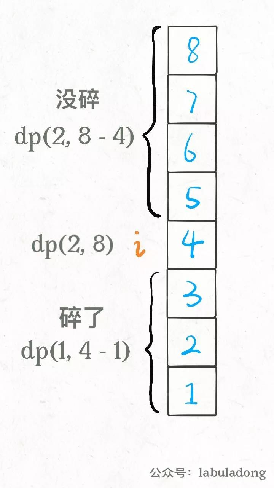
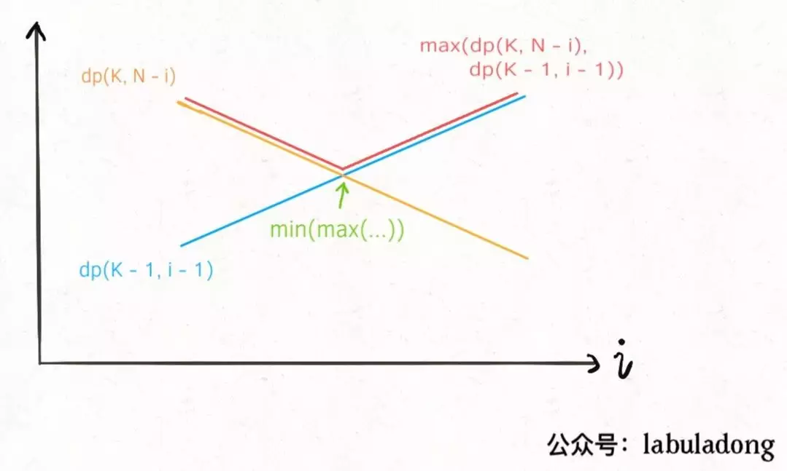

# 887. 鸡蛋掉落

[https://leetcode-cn.com/problems/super-egg-drop/](https://leetcode-cn.com/problems/super-egg-drop/)

## 解法一：dp

我们在第i层楼扔了鸡蛋之后，可能出现两种情况：鸡蛋碎了，鸡蛋没碎。注意，这时候状态转移就来了：
如果鸡蛋碎了，那么鸡蛋的个数K应该减一，搜索的楼层区间应该从[1..N]变为[1..i-1]共i-1层楼；
如果鸡蛋没碎，那么鸡蛋的个数K不变，搜索的楼层区间应该从 [1..N]变为[i+1..N]共N-i层楼。

```python
class Solution:
    def superEggDrop(self, K: int, N: int):
        memo = dict()
        #定义状态转移函数
        def dp(K, N) -> int:
            # base case
            if K == 1: return N
            if N == 0: return 0
            # 避免重复计算
            if (K, N) in memo:
                return memo[(K, N)]
            res = float('INF')
            # 穷举所有可能的选择
            for i in range(1, N + 1):
                res = min(res, 
                        max(
                                dp(K, N - i), #没碎
                                dp(K - 1, i - 1)	#碎
                            ) + 1	#在第i楼扔了一次
                    )
            # 记入备忘录
            memo[(K, N)] = res
            return res
        return dp(K, N)    #调用dp函数
```
## 改进
上面代码对用例4，5000会报超时，递归栈爆了。可以利用dp函数的单调性（见下图），将求
```max(dp(K, N - i), dp(K - 1, i - 1))```
的过程优化为二分，找最低点

注意之前求的是
```res = min(res, max(dp(K, N - i), dp(K - 1, i - 1)) + 1)```
因此二分过程中求的dp要加一再与res比较
```python
class Solution:
    def superEggDrop(self, k: int, n: int) -> int:
        memo = {}
        def dp(k, n):
            if k == 1: return n
            if n == 0: return 0
            if (k, n) in memo:
                return memo[(k, n)]
            res = sys.maxsize
            l = 1
            r = n
			#用二分优化
            while l <= r:
                mid = l + (r - l) // 2
                broken = dp(k - 1, mid - 1)  # 碎，随mid递增
                not_broken = dp(k, n - mid)  # 没碎，随mid递减
                if broken > not_broken:
                    r = mid - 1
                    res = min(res, broken + 1)  #注意加1
                else:
                    l = mid + 1
                    res = min(res, not_broken + 1) #注意加1
            memo[(k, n)] = res
            return res
        return dp(k, n)
```

### 重写状态转移
之前定义的dp数组含义：
```
def dp(k, n) -> int
# 当前状态为 k 个鸡蛋，面对 n 层楼
# 返回这个状态下最少的扔鸡蛋次数
```
用 dp 数组表示的话也是一样的：
```
dp[k][n] = m
# 当前状态为 k 个鸡蛋，面对 n 层楼
# 这个状态下最少的扔鸡蛋次数为 m
```

即：确定当前的鸡蛋个数和楼层数，就知道最小扔鸡蛋次数

现将dp定义修改为：确定当前鸡蛋个数和最多允许的扔鸡蛋次数，求通过这两个条件确定的最高楼层数

```
dp[k][m] = n
# 当前有 k 个鸡蛋，可以尝试扔 m 次鸡蛋
# 这个状态下，最坏情况下最多能确切测试一栋 n 层的楼
```
比如说 `dp[1][7] = 7 `表示：
现在有 1 个鸡蛋，允许你扔 7 次;
这个状态下最多给你 7 层楼，
使得你可以确定楼层 F 使得鸡蛋恰好摔不碎 （一层一层线性探查）

最终要求的其实是扔鸡蛋次数`m`，但是这时候`m`在状态之中而不是`dp`数组的结果。因此题目就是给`K`鸡蛋，`N`层楼，让你求最坏情况下最少的测试次数`m`，`while`循环结束的条件是`dp[K][m] == N`

原始解法还得线性或者二分扫描所有楼层，要求最大值、最小值。但是现在这种dp定义根本不需要这些了，基于下面两个事实：

1、无论你在哪层楼扔鸡蛋，鸡蛋只可能摔碎或者没摔碎，碎了的话就测楼下，没碎的话就测楼上。

2、无论你上楼还是下楼，总的楼层数 = 楼上的楼层数 + 楼下的楼层数 + 1（当前这层楼）。

得状态转移方程：
```
dp[k][m]  = dp[k][m-1] + dp[k-1][m-1] + 1
			楼上的楼层数    楼下的楼层数   本层
```
由方程可知`dp[k][m]`依赖左边和左上的元素，因此遍历应以列为优先顺序
最后求的是使`dp[K][m]>=N`的最小m，因此循环退出时，要考虑`dp[K][m]`与N的关系
```python
class Solution:
    def superEggDrop(self, K: int, N: int) -> int:
        # m最多不会超过N次（线性扫描）
        dp = [[0] * (N + 1) for _ in range(K + 1)]
        m=0
        # m<N防止纵坐标越界
        while m < N and dp[K][m] <= N:
            m +=1
            for k in range(1, K+1):
                dp[k][m] = dp[k][m-1] + dp[k-1][m-1] + 1
        if dp[K][m-1] < N:
            return m
        elif dp[K][m-1] == N:	
            return m-1
```