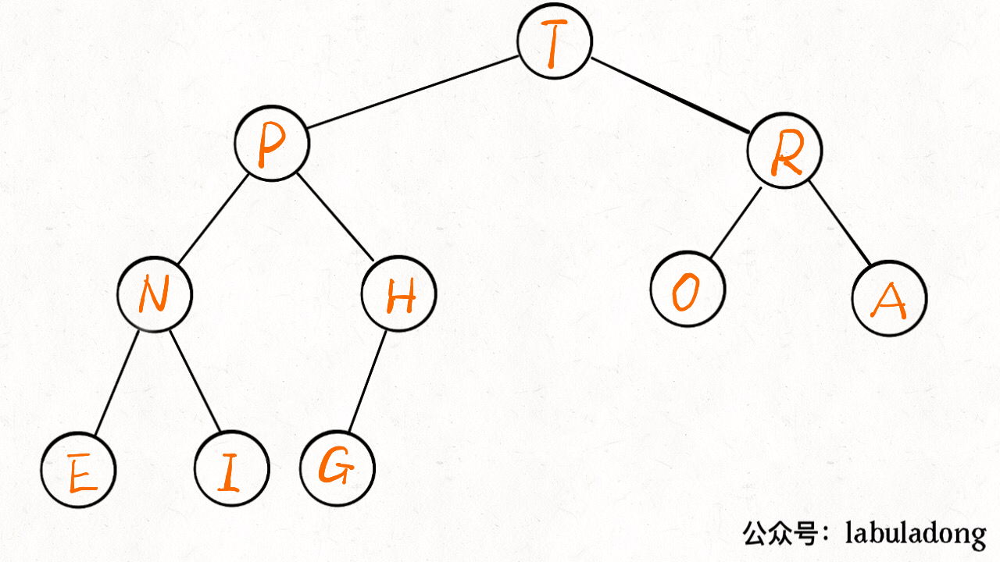
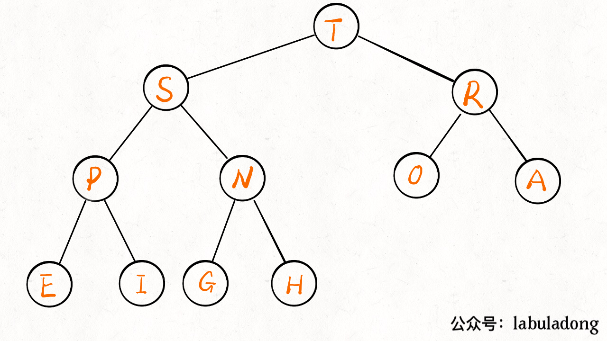

# 堆总结

二叉堆就是一种完全二叉树，存储在数组中，用下标表示位置

操作很简单，主要就是**上浮**和**下沉**，来维护堆的性质（堆有序）

## 优先级队列

是基于二叉堆实现的，主要操作是插入和删除。插入是先插到最后，然后上浮到正确位置；删除是删堆顶，先将堆顶与堆底调换位置后再删除，然后新堆顶下沉到正确位置。（直接删顶要考虑维护堆性质，而直接删底不用，因此采用交换后删除的方式）

## 时间复杂度

插入和删除元素的时间复杂度为 `O(logK)`，`K` 为当前二叉堆（优先级队列）中的元素总数。因为我们时间复杂度主要花费在 `sink` 或者 `swim` 上，而不管上浮还是下沉，最多也就树（堆）的高度，也就是 log 级别。

## 具体实现

优先级队列数据结构

```java
public class MaxPQ
    <Key extends Comparable<Key>> {
    // 存储元素的数组
    private Key[] pq;
    // 当前 Priority Queue 中的元素个数
    private int N = 0;

    public MaxPQ(int cap) {
        // 索引 0 不用，所以多分配一个空间
        pq = (Key[]) new Comparable[cap + 1];
    }

    /* 返回当前队列中最大元素 */
    public Key max() {
        return pq[1];
    }

    /* 插入元素 e */
    public void insert(Key e) {...}

    /* 删除并返回当前队列中最大元素 */
    public Key delMax() {...}

    /* 上浮第 k 个元素，以维护最大堆性质 */
    private void swim(int k) {...}

    /* 下沉第 k 个元素，以维护最大堆性质 */
    private void sink(int k) {...}

    /* 交换数组的两个元素 */
    private void exch(int i, int j) {
        Key temp = pq[i];
        pq[i] = pq[j];
        pq[j] = temp;
    }

    /* pq[i] 是否比 pq[j] 小？ */
    private boolean less(int i, int j) {
        return pq[i].compareTo(pq[j]) < 0;
    }

    /* 还有 left, right, parent 三个方法 */
}
```


插入



```java
public void insert(Key e) {
    N++;
    // 先把新元素加到最后
    pq[N] = e;
    // 然后让它上浮到正确的位置
    swim(N);
}
```

删除



```java
public Key delMax() {
    // 最大堆的堆顶就是最大元素
    Key max = pq[1];
    // 把这个最大元素换到最后，删除之
    exch(1, N);
    pq[N] = null;
    N--;
    // 让 pq[1] 下沉到正确位置
    sink(1);
    return max;
}
```

上浮

```java
private void swim(int k) {
    // 如果浮到堆顶，就不能再上浮了
    while (k > 1 && less(parent(k), k)) {
        // 如果第 k 个元素比上层大
        // 将 k 换上去
        exch(parent(k), k);
        k = parent(k);
    }
}
```

下沉

```java
private void sink(int k) {
    // 如果沉到堆底，就沉不下去了
    while (left(k) <= N) {
        // 先假设左边节点较大
        int older = left(k);
        // 如果右边节点存在，比一下大小
        if (right(k) <= N && less(older, right(k)))
            older = right(k);
        // 结点 k 比俩孩子都大，就不必下沉了
        if (less(older, k)) break;
        // 否则，不符合最大堆的结构，下沉 k 结点
        exch(k, older);
        k = older;
    }
}
```

